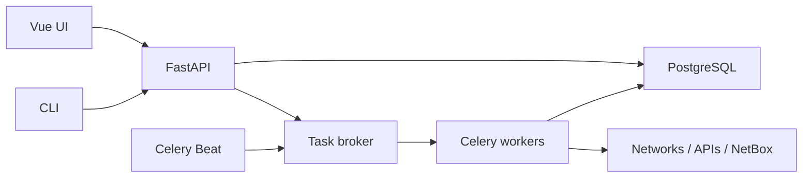

# 🚀 NetVoyager

**Explore your network. Keep the evidence. Build a trustworthy inventory.**

NetVoyager is a network discovery and inventory project for engineers who need to bring together observations from live networks, files, and external APIs. The intended workflow is to compare those observations with NetBox, review the differences, and apply approved changes.

> **Status:** Initial repository scaffold. The CLI currently provides `--help` and `--version`. API endpoints, scans, scheduled jobs, authentication, and NetBox sync are planned and are not implemented yet.

## ✨ What we're building

- **Discover:** Run scoped network probes from a worker that can reach the target site.
- **Collect:** Ingest files and data from external APIs.
- **Compare:** Keep observed data separate from approved NetBox inventory.
- **Review:** Show proposed additions and changes before writing to NetBox.
- **Automate:** Queue manual jobs and schedule recurring collection.
- **Access anywhere:** Use the web UI or an independently installable CLI.

## 🧩 Architecture



The API accepts requests and creates jobs. Workers perform scans, imports, comparisons, and approved sync operations. PostgreSQL stores schedules, observations, and job history; the broker carries task messages. The CLI calls the API over HTTPS and does not install server code.

See [Architecture Overview](docs/architecture/overview.md) for the component boundaries.

## 📁 Repository layout

| Path | Purpose |
| --- | --- |
| `apps/api` | FastAPI application |
| `apps/worker` | Celery job execution |
| `apps/scheduler` | Celery Beat and recurring schedule dispatch |
| `apps/cli` | Standalone API client package |
| `apps/web` | Vue frontend |
| `packages/netvoyager-core` | Shared domain models and validation |
| `packages/netvoyager-discovery` | Network discovery logic |
| `packages/netvoyager-import` | File and external API ingestion |
| `packages/netvoyager-netbox` | NetBox comparison and synchronization |
| `deploy` | Deployment configuration |
| `docs` | Design and usage documentation |

## 🖥️ Try the CLI scaffold

Requires Python 3.11 or later. From the repository root:

```bash
python -m venv .venv
source .venv/bin/activate
python -m pip install -e apps/cli
netvoyager --help
```

On Windows PowerShell, activate the environment with `.venv\Scripts\Activate.ps1` instead. The current CLI is only a packaging and command-entry scaffold; `site get` and other API commands will be added with the corresponding endpoints.

## 📦 Install only the CLI on another PC

Build a wheel on a development machine:

```bash
python -m pip install build
python -m build apps/cli --wheel --outdir dist
```

Copy the generated `netvoyager_cli-*.whl` to the client PC and run:

```bash
python -m pip install netvoyager_cli-*.whl
netvoyager --help
```

The client PC does **not** need a clone of this repository, the API, the worker, or Vue. Once API commands are implemented, it will need access to the NetVoyager service.

## 🛠️ Next milestones

1. Implement the first site endpoint and the matching `netvoyager site get` CLI command.
2. Add PostgreSQL models for jobs, observations, and schedules.
3. Connect Celery workers and a dedicated task broker.
4. Implement scoped discovery and reviewable NetBox differences.
5. Add the Vue UI and user-managed recurring schedules.

## 🤝 Contributing and security

See [Contributing](CONTRIBUTING.md) for development conventions and [Security](SECURITY.md) for handling sensitive network data. Do not commit credentials or production scan results.
